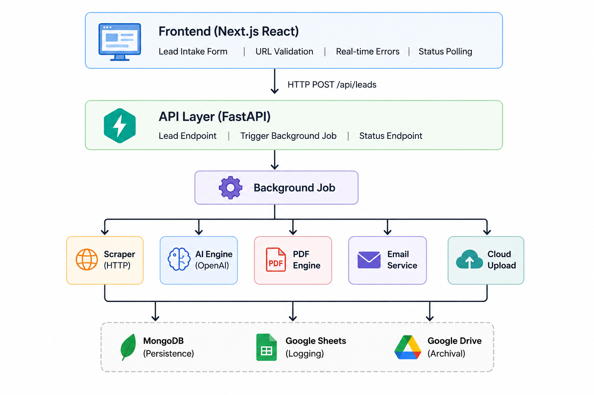

# AI Growth Audit Platform

AI Growth Audit is a full-stack lead intake and reporting system that turns a company website into a polished AI-generated business audit. The product captures prospect details, enriches the company from its public website, generates strategic AI insights, renders a premium PDF report, emails the result, and records the workflow through MongoDB and Google APIs.

The goal is to feel like a compact internal growth intelligence product: fast lead capture, automated analysis, premium reporting, and CRM-style operational tracking.

## Quick Start

### Prerequisites
- Python 3.10+, Node.js 18+, MongoDB Atlas, OpenAI API key

### Setup (5 minutes)

**Backend**:
```bash
cd backend
conda create -n autoflow python=3.10
conda activate autoflow
pip install -r requirements.txt
# Create .env with MONGODB_URI, OPENAI_API_KEY, etc.
uvicorn app.main:app --reload
```

**Frontend**:
```bash
cd frontend
npm install
npm run dev
```

**Test**: Open `http://localhost:3000` and submit form

### Documentation
- **[ARCHITECTURE.md](ARCHITECTURE.md)** - System design & architectural decisions
- **[SETUP.md](SETUP.md)** - Comprehensive setup & deployment guide
- **[API.md](API.md)** - API endpoints & integration patterns

## Architecture



## Product Flow

1. A user submits company details through the Next.js frontend.
2. FastAPI stores the lead in MongoDB with a `processing` status.
3. A background workflow scrapes the company website for content, CTAs, headings, forms, and positioning signals.
4. The AI pipeline generates a personalized business audit with scorecards and recommendations.
5. The PDF engine renders a startup-grade report with metrics, scorecards, highlights, and branded sections.
6. The email service sends the finished report to the lead.
7. Google Drive archives the PDF and Google Sheets logs the lead for CRM-style tracking.

## Features

- AI-powered company enrichment
- Automated business audit generation
- Personalized PDF reporting
- Background workflow processing
- CRM-style Google Sheets tracking
- Automated cloud archival
- MongoDB lead persistence
- Premium report scorecards for website clarity, CTA effectiveness, automation readiness, and growth potential
- Email delivery with attached PDF reports
- Polished lead capture UI with loading and success states

## Tech Stack

| Layer | Technology |
| --- | --- |
| Frontend | Next.js, React, Tailwind CSS, Axios |
| Backend | FastAPI, Python |
| Database | MongoDB with Motor |
| AI | Groq LLM API |
| Scraping | Requests, BeautifulSoup |
| PDF | Jinja2, WeasyPrint |
| Email | Resend |
| Cloud Tracking | Google Drive API, Google Sheets API |

## Backend Services

- `scraper.py` extracts website title, meta description, headings, buttons, links, forms, and page content.
- `ai_service.py` converts scraped website data into a structured AI growth audit.
- `pdf_service.py` renders a premium PDF report with dark header, metrics, scorecards, insight cards, and recommendation highlights.
- `email_service.py` sends the generated PDF to the submitted email address.
- `drive_service.py` uploads reports to Google Drive and creates a shareable archive link.
- `sheets_service.py` logs completed leads into Google Sheets for lightweight CRM tracking.

## API

### Submit Lead

```http
POST /api/leads
```

Request body:

```json
{
  "name": "Alex Morgan",
  "email": "alex@company.com",
  "company": "Acme AI",
  "website": "https://acme.ai",
  "notes": "Interested in improving demo conversions"
}
```

Response:

```json
{
  "success": true,
  "lead_id": "mongodb_object_id",
  "message": "Audit generation started"
}
```

## Environment Variables

Create `backend/.env` with the required service credentials:

```env
MONGO_URI=
GROQ_API_KEY=
RESEND_API_KEY=
SENDER_EMAIL=
```

Google API credentials are expected through `service_account.json` for Drive and Sheets integrations.

## Running Locally

### Backend

```bash
cd backend
pip install -r requirements.txt
uvicorn app.main:app --reload
```

The API runs at:

```text
http://127.0.0.1:8000
```

### Frontend

```bash
cd frontend
npm install
npm run dev
```

The frontend runs at:

```text
http://localhost:3000
```

## Why This Project Stands Out

This is more than a form submission app. It demonstrates a complete AI workflow with real product surface area: lead capture, asynchronous processing, web enrichment, LLM analysis, PDF generation, transactional email, persistent database state, and Google Workspace automation.

The result is a recruiter-friendly demo that communicates both engineering depth and product thinking.
